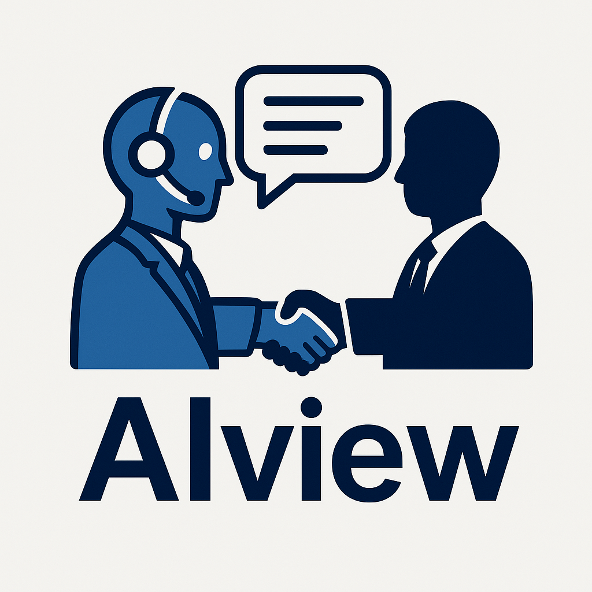

<p align="center">
    
</p>

## Description

TriaGen é uma plataforma de entrevistas simuladas com IA que utiliza modelos de linguagem para avaliar candidatos com base na vaga desejada e no currículo fornecido.

Dado o perfil do usuário (currículo) e os requisitos de uma vaga, o sistema conduz uma entrevista simulada via chat, formulando perguntas relevantes e analisando respostas em tempo real.

O objetivo é oferecer uma ferramenta de preparação e triagem inteligente, útil tanto para candidatos quanto para recrutadores.

## Project setup

```bash
$ npm install
```

## Environment variables

Create a `.env` file based on the provided `.env.example` and set the following keys:

```
WHATSAPP_VERIFY_TOKEN=<your verify token>
WHATSAPP_API_URL=<whatsapp base url>
WHATSAPP_PHONE_NUMBER_ID=<phone number id>
WHATSAPP_API_KEY=<api key>
REDIS_HOST=<redis host>
REDIS_PORT=<redis port>
PORT=<application port>
```

## Compile and run the project

```bash
# development
$ npm run start

# watch mode
$ npm run start:dev

# production mode
$ npm run start:prod
```

## Run tests

```bash
# unit tests
$ npm run test

# e2e tests
$ npm run test:e2e

# test coverage
$ npm run test:cov
```
